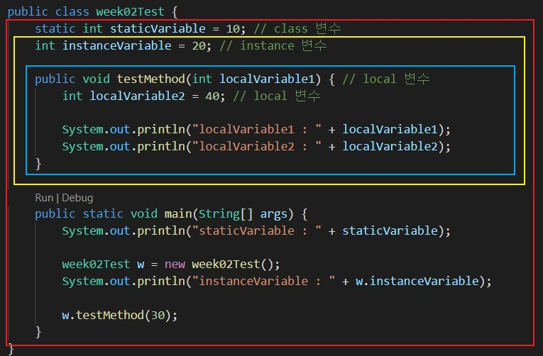
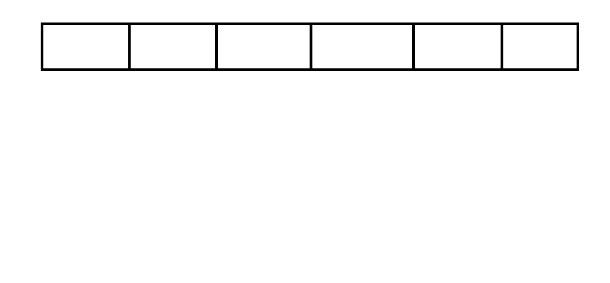
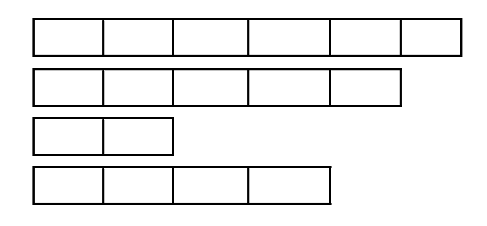

# 💎 자바 데이터 타입, 변수 그리고 배열

# 목표

자바의 프리미티브 타입, 변수 그리고 배열을 사용하는 방법을 익힙니다.

# 목차

- [프리미티브 타입 종류와 값의 범위 그리고 기본 값](#Primitive-Type기본형-프리미티브 타입)
- [프리미티브 타입과 레퍼런스 타입](#Reference-Type참조형-레퍼런스-타입)
- [리터럴](#변수-상수-리터럴)
- [변수 선언 및 초기화하는 방법](#변수-선언-및-초기화하는-방법)
- [변수의 스코프와 라이프타임](#변수의-스코프와-라이프타임)
- [타입 변환, 캐스팅 그리고 타입 프로모션](#타입-변환-캐스팅-그리고-타입-프로모션)
- [1차 및 2차 배열 선언하기](#1차-및-2차-배열-선언하기)
- [타입 추론, var](#타입-추론-var)

-----

자료형은 크게 '기본형'과 '참조형' 두 가지로 나눌 수 있는데, 기본형 변수는 실제 값(data)를 저장하는 반면, 참조형 변수는 어떤 값이 저장되어 있는 주소(memory address)를 값으로 가진다. 먼저, 기본형(Primitive Type)에 대해 알아보자.

# Primitive Type(기본형, 프리미티브 타입)

## Primitive Type이란

논리형, 문자형, 정수형, 실수형 계산을 위해 실제 값을 저장하는 타입을 말한다.

실제값이 저장되는 공간은 stack 메모리 공간이다.

기본형은 총 8가지이다. 크게는 정수형(byte, short, int, long), 실수형(float, double), 문자형(char), 논리형(boolean)으로 나눌 수 있다.

## 종류

**1. 논리형**

 true와 false 중 하나를 값으로 갖으며, 조건식과 논리적 계산에 사용된다.

[논리형의 표현 범위]


| 타입  | 할당되는 메모리의 크기 | 데이터의 표현 범위 |
|----|-------|----|
| boolean | 1byte  | true 또는 false    |

**2. 문자형**

문자를 저장하는데 사용되며, 변수에 문자열이 아닌 하나의 문자만 저장할 수 있다.

[문자형의 표현 범위]

| 타입 | 할당되는 메모리의 크기 | 데이터의 표현 범위 |
|----|-------|----|
| char | 2byte    | 0 ~ 216 |

**3. 정수형**

정수를 저장하는데 사용되며, 주로 int가 사용된다. byte는 이진 데이터를 다룰 때 사용되며, short은 C언어와의 호환을 위해 추가되었다.

[정수형의 표현 범위]

모든 정수형은 부호있는 정수이므로 왼쪽 첫 번째 비트를 ’부호 비트’로 사용, 나머지는 값을 표현한다.

그래서 n비트로 표현할 수 있는 값의 개수인 개에서, 절반인 ‘0’(양수비트)으로 시작하는 $2^n-1$개의 값을 양수를 표현하는데 사용하고, 나머지 절반인 ‘1’(음수비트)로 시작하는 $2^n-1$개의 값은 음수의 표현에 사용된다.

| 타입  | 할당되는 메모리의 크기 | 데이터의 표현 범위         |
|------|-------|--------|
| byte  | 1byte    | -128 ~ 127   |
| short | 2byte    | -32,768 ~ 32,767           |
| int   | 4byte    | -2,147,483,648 ~ 2,147,483,647           |
| long  | 8byte    | -9,223,372,036,854,775,808 ~ 9,223,372,036,854,775,807 |

**4. 실수형**

소수점을 포함하는 실수를 저장하는데 사용된다. 하드웨어의 발달로 인한 메모리 공간의 증가로 현재에는 주로 double이 사용된다.

[실수형의 표현범위]

| 타입   | 할당되는 메모리의 크기 | 데이터의 표현 범위(양수)             | 정밀도 |
|----|-------|--------|----|
| float  | 4byte    | (1.4 X 10-45) ~ (3.4 X 1038) | 7자리  |
| double | 8byte    | (4.9 X 10-324) ~ (1.8 X 308) | 15자리 |

# Reference Type(참조형, 레퍼런스 타입)

## Reference Type이란

객체의 주소를 저장하는 타입이다. 쉽게 말하자면 8개의 기본형을 제외한 나머지 타입이다.

자바는 C언어와 달리 주소연산자(&)나 포인터연산자(*)를 사용하여 메모리에 직접 접근할 수 없음으로 실제 연산에 사용되는 것은 거의 대부분 기본형 변수이다.(자바의 특징 중 하나가 자동으로 메모리 관리를 해준다는 것이다.)

그러나 자바가 참조변수를 사용할 때도 있다. 예를 들면 String 타입이나 객체를 선언할 때 등이다.

String은 기본형 변수가 아니지만 Java에서 기본형 변수처럼 사용하게 만들어준다. 즉, 기본형이 아니므로 참조형 변수이다.

이번에 프리미티브 타입과 레퍼런스 타입의 차이를 하나 더 알게 되었다!  int, double는 프리미티브 타입이고  Integer, Double는 레퍼런스 타입이다. 프리미티브 타입은 Null값을 처리할 수 없지만 레퍼런스 타입은 Null값을 처리할 수 있기 때문에 SQL 연동에 더 유리하다. VO나 DTO를 작성할 때 Integer, Double를 사용하는 이유가 위와 같다. 

## 참조변수 선언하는 방법

```java
[클래스이름] [변수이름]; 
// 변수의 타입이 기본형이 아닌 것들은 모두 참조변수
```

자바를 미리 배웠다면 어디서 흔히 보던 구조이다. 객체를 선언해줄 때 위와 같은 형태로 선언해준다. 따라서 클래스의 이름은 참조변수의 타입이 되는 것이다.

# 변수, 상수, 리터럴

변수(Variable)는 하나의 값을 저장하기 위한 공간이다.

상수(Constant)는 값을 한번만 저장할 수 있는 공간이다.

리터럴(Literal)은 그 자체로 값을 의미하는 것이다.

```java
int year = 2021;
// year은 변수, 2021는 리터럴
final int MAX = 100;
// MAX는 상수, 100은 리터럴
```

변수와 상수의 차이는 예시를 봐도 큰 부분이 차이가 있다. 바로 `final` 이다. `final` 이 붙으면 상수가 되며 이후에 값을 변경하지 못한다. 또한, 상수를 생성할 때는 통상적으로 대문자를 사용하며 의미있는 이름을 붙인다.

## 리터럴

위에서는 상수, 변수, 리터럴에 대해 알아보았다. 리터럴에 대해 좀 더 자세히 알아보려고 한다. 변수에 타입이 있는 것처럼 리터럴에도 타입이 있다.

**리터럴과 접미사**

| 종류 |       리터럴          |   접미사  |
|----|-------|----| 
| 논리형 | false, true            | 없음 |
| 정수형 | 123, 0b0101, 077, 0xFF, 100L | L |
| 실수형 | 3.14, 3.0e8, 1.4f | f,d |
| 문자형 | 'A', '1' '\n' | 없음 |
| 문자열 | "ABC", "123", "A", "true" | 없음 |

# 변수 선언 및 초기화하는 방법

변수, 상수, 리터럴 부분에서 변수에 대해 간단히 살펴보았다. 지금부터 변수에 대해 더 자세히 알아보자. 

변수는 단 하나의 값을 저장할 수 있는 메모리 공간을 말한다. 단 하나의 값만 저장할 수 있으므로 새로운 값을 저장하게 될 경우, 기존의 값은 사라지게 된다.

## 변수 선언

```java
[변수타입] [변수이름];
int age;
char name;
boolean check;
```

변수타입은 위에 봤던 기본형 타입 중에서 필요한 타입으로 작성해주면 된다. 변수이름은 개발자가 알아서 이름을 지정하지만 다른 사람이 봐도 이해할 수 있는 변수명으로 작성하는 것이 좋다.

## 변수 초기화

변수를 선언한 이후부터는 변수를 사용할 수 있으나, 그 전에 반드시 변수를 초기화(initialization)해야 한다. 메모리는 여러 프로그램이 공유하는 자원이므로 전에 다른 프로그램에 의해 저장된 알 수 없는 값(쓰레기값)이 남아있을 수도 있기 때문이다. 그러면 변수 초기화란 무엇일까?

변수의 초기화란 변수를 사용하기 전에 처음으로 값을 저장하는 것이다.  변수를 처음 선언할 때 값을 저장해주고값을 저장할 때는 `=` (대입연산자)를 사용하며 오른쪽의 값을 왼쪽 변수에 저장하라는 의미이다. 

```java
int age = 25; //변수의 초기화
int year = 2021; //변수의 초기화
...
age = 26;
year = 2034;
```

# 변수의 스코프와 라이프타임

**변수의 스코프(Scope)**

프로그램상에서 사용되는 변수들은 사용 가능한 범위를 가진다. 그 범위를 변수의 스코프라고 한다.

**변수의 라이프타임(Lifetime)**

변수가 메모리에서 살아있는 기간이다.

세 가지 유형의 변수들이 있다.

1. Instance Variables(인스턴스 변수)
2. Class Variables(클래스 변수)
3. Local Variables(지역 변수)

### Instance Variables

**정의**

1.클래스 내부에서 선언

2.메소드 및 블록 외부에서 선언

**Scope**

정적 메소드(static method)를 제외한 클래스 전체.

**라이프타임**

클래스의 객체가 메모리에 남아있을 때까지.

인스턴스 변수는 클래스를 인스턴스화 되고 난 뒤에 사용할 수 있다. 해당 객체가 메모리에 남아있을 때까지 인스턴스 변수도 남아있을 수 있다. 

### Class Variables

**정의**

1.클래스 내부에서 선언

2.메소드나 블록 외부에서 선언

3.static 키워드가 포함되어 선언

**스코프**

클래스 전체

**라이프타임**

프로그램이 종료될 때 까지

모든 클래스는 인스턴스화 하지 않은 채로 사용할 수 없다(붕어빵틀 ≠ 붕어빵). 해당 클래스를 new로 인스턴스화 하지 않아도 main메소드가 실행되었던 이유는 static이다(`public static void main(String[] args)` ). 키워드 static을 사용하면 인스턴스화 하지 않아도 사용할 수 있다.

### Local Variables

**정의**

인스턴스 변수나 클래스 변수가 아닌 모든 변수

**스코프**

변수가 선언된 블록 내부

**라이프타임**

변수가 선언된 블록 내부에 프로그램이 작동하는 동안

예제를 살펴보자. (빨간색 - class 변수, 노란색 - instance 변수, 파란색 - local 변수)



```java
public class week02Test {
    static int staticVariable = 10; // class 변수
    int instanceVariable = 20; // instance 변수

    public void testMethod(int localVariable1) { // local 변수
        int localVariable2 = 40; // local 변수

        System.out.println("localVariable1 : " + localVariable1);
        System.out.println("localVariable2 : " + localVariable2);
    }

    public static void main(String[] args) {
        System.out.println("staticVariable : " + staticVariable);

        week02Test w = new week02Test();
        System.out.println("instanceVariable : " + w.instanceVariable);

        w.testMethod(30);
    }
}
```

출력결과

```java
staticVariable : 10
instanceVariable : 20
localVariable1 : 30
localVariable2 : 40
```

# 타입 변환, 캐스팅 그리고 타입 프로모션

## 타입 변환(Type Conversion)

하나의 타입을 다른 타입으로 바꾸는 것을 타입 변환이라고 한다.

Java에서는 기본형에서 boolean형을 제외한 나머지 타입들은 서로 형변환이 가능하다. 그리고 기본형과 참조형간의 형변환은 불가능하다.

먼저, 기본형의 형변환에 대해 알아보자

## 기본형 변수의 타입 변환

자바에서 타입 변환은 크게 다음과 같이 두 가지 방식으로 나뉜다.

1. 묵시적 타입 변환(자동 타입 변환)
2. 명시적 타입 변환(강제 타입 변환)

### 타입 프로모션(묵시적 타입 변환, 자동 타입 변환)

묵시적 타입 변환이란 대입 연산이나 산술 연산에서 컴파일러가 자동으로 수행해주는 타입 변환을 말한다. 

자바에서는 데이터의 손실이 발생하지 않거나 최소화되는 방향으로 묵시적 타입 변환을 한다. 또한, 데이터의 손실이 발생하는 대입 연산은 허용하지 않는다.

그래서 크기가 작은 타입을 크기가 더 큰 타입으로 바꿀 때에 묵시적으로 형을 바꾸어준다.

```java
int x = 10;
float y = x;
```

타입의 표현 범위에 따라 다음과 같은 방향으로 자동 타입 변환이 이루어진다.

byte형 → short형 → int형 → long형 → float형 → double형

char형 → int형 → long형 → float형 → double형

### 캐스팅(명시적 타입 변환, 강제 타입 변환)

명시적 타입 변환이란 사용자가 타입 캐스트 연산자(())를 사용하여 강제적으로 수행하는 타입 변환을 말한다. 

즉, 크기가 더 큰 타입을 작은 타입으로 바꿀 때에 명시적으로 변환 해주어야한다.

```java
(변환할타입) 변환할 데이터
```

변환시키고자 하는 데이터의 앞에 괄호를 넣고, 그 괄호 안에 변환할 타입을 적으면 된다. 이 괄호를 타입 캐스트(type cast) 연산자라고 한다.

```java
float x = 10.5f;
// int y = x; // (이렇게 묵시적으로 실행하면 컴파일러는 오류를 발생시킨다.)
int y = (int) x; // y의 값은 10이 된다.
```

## 참조변수의 타입 변환

기본형 변수와 같이 참조변수도 형변환이 가능하다. 단, 서로 상속관계에 있는 클래스 사이에서만 형변환이 가능하다.

기본형 변수의 타입변환에서 작은 자료형에서 큰 자료형의 형변환은 생략가능하듯이, 참조형 변수의 형변환에서는 자손변수를 조상타입으로 형변환하는 경우 형변환을 생략할 수 있다.

```java
자손타입 -> 조상타입(Up-Casting) : 형변환 생략가능
자손타입 <- 조상타입(Down-Casting) : 형변환 생략불가능
```

# 1차 및 2차 배열 선언하기

배열은 같은 타입의 여러 변수를 하나의 묶음으로 다루는 것이다. 



위 이미지는 정수 6개를 담을 수 있는 배열이 선언된 것이다.

## 1차원 배열

배열을 선언하고 난 뒤 생성을 해줘야 배열을 사용할 수 있다. 

### 1차원 배열 선언

자바에서 1차 배열 선언 방법은 두 가지이다.

1. `타입[] 변수이름;`
2. `타입 변수이름[];` 

1번의 선언 예를 보자.

```java
int[] score;
String[] name;
```

2번의 선언 예를 보자.

```java
int score[];
String name[];
```

### 1차원 배열 생성

```java
변수이름 = new 타입[길이];
```

예를 통해서 1차 배열을 선언하고 생성해보자.

```java
int[] score; // 배열 선언
score = new int [10]; // 배열 생성

int[] score = new int [10]; // 배열 선언과 생성을 동시에
```

## 2차원 배열

2차원 배열이란 배열의 배열이다. 


위 이미지는 정수를 6개 담을 수 있는 배열이 4개 생성된 것이다.

### 2차원 배열 선언 및 생성

2차원 배열 선언 및 생성이 1차원 배열의 선언과 생성과 같다. 단, 배열의 배열이므로 `[]` 가 하나 더 추가가 된다.

먼저, 2차원 배열의 선언 방법은 아래와 같다.

1. `타입[][] 변수이름;`
2. `타입 변수이름[][];` 

2차원 배열의 생성 방법은 아래와 같다.

```java
변수이름 = new 타입[길이1][길이2];
```

길이1은 1차원 배열이 몇 개 생성되는 지의 수를 나타내며 길이2는 1차원 배열 내에 몇 개를 담을 수 있는 지를 나타낸다. 

예를 통해 2차원 배열의 선언과 생성을 동시에 해보자.

```java
int[][] array4 = new int[4][6];
// 정수를 6개씩 담을 수 있는 배열이 4개 생성(위 이미지와 동일)
```

### 가변크기의 2차원 배열

각 배열의 크기를 다르게 지정할 수 있다.



**가변크기의 2차원 배열을 생성하는 방법**

```java
int[][] array5 = new int[3][];
//위와 같이 선언하면 array5는 3개짜리 배열을 참조한다. 3개짜리 배열은 아직 참조하는 배열이 없다는 것을 의미.

array5[0] = new int[1]; //정수를 하나 담을 수 있는 배열을 생성해서 array5 의 0 번째 인덱스가 참조한다.  
array5[1] = new int[2]; //정수를 두개 담을 수 있는 배열을 생성해서 array5 의 1 번째 인덱스가 참조한다.  
array5[2] = new int[3]; //정수를 세개 담을 수 있는 배열을 생성해서 array5 의 2 번째 인덱스가 참조한다.
```

# 타입 추론, var

참고) Java 10부터 var를 지원한다.

var는 지역변수를 선언할 때 초기값을 통해 데이터 타입을 추론한다.

```java
var i = 1; // int로 추론
var str = "Java"; // String으로 추론
var list = new ArrayList<String>(); // ArrayList<String>으로 추론
var person = new Person(); // Person person = new Person();
```

var을 사용 시 주의해야할 점

```java
public class VarTest {
    // var는 지역변수에서만 사용 가능
		var a = 1;

    public static void main(String[] args) {
				// ,와 함께 사용할 수 없다.
				var x = 1, y = 2; 
				
				// null 값은 String에서만 사용하는 것이 아니므로 타입 추론이 불가능하다.
				var str = null;
				
				// var을 사용할 때에는 초기화를 바로 해야한다. 초기화하지 않으면 타입 추론이 불가능하다.
				var err;
				err = 1;
				
				// 람다식에서 사용 불가능하다.
				var x = () -> {}
		}
		// 메소드의 인수타입은 지역변수여도 var 사용 불가
		void test(var x) {} 
}
```

var를 사용함으로 Java Script와 비슷하게 Java가 동적인 특징을 가지게 된다라고 생각할 수 있지만 아니다. var는 컴파일 단계에서 변수의 유형을 유추한 후 정적으로 사용된다. 

# 참고

[변수의 scope와 static](https://programmers.co.kr/learn/courses/5/lessons/231)

[변수의 스코프와 라이프타임](https://www.learningjournal.guru/article/programming-in-java/scope-and-lifetime-of-a-variable/)

[타입 변환](http://www.tcpschool.com/java/java_datatype_typeConversion)

[2차원 배열](https://programmers.co.kr/learn/courses/5/lessons/135)

[타입추론, var](https://congcoding.tistory.com/60)
