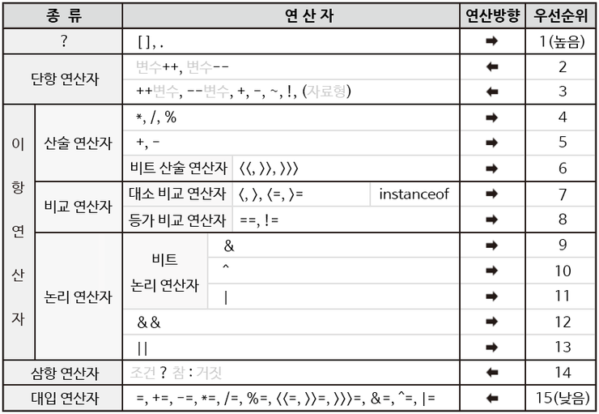

# 💎 연산자

## 목표

자바가 제공하는 다양한 연산자를 학습하는 것이 목표이나 산술·비트·관계·논리·대입·3항 연산자는 기존에 아는 개념이므로 다루지 않고 넘어가기로 했다.

## 목차

- [instanceof](#instanceof)
- [화살표(->) 연산자](#화살표-연산자)
- [연산자 우선 순위](#연산자우선순위)
- [(optional) Java 13. switch 연산자](#java13switch연산자)

---

# instanceof

instanceof연산자는 참조변수가 참조하고 있는 인스턴스의 실제 타입을 알아보기 위해 사용한다. instanceof연산자로 인스턴스의 타입을 체크한 뒤 적절한 형변환하기 위해서이다 . 주로 조건문에 사용되며, instanceof의 왼쪽에는 참조변수를 오른쪽에는 타입(클래스명)이 피연산자로 `객체 instanceof 클래스` 이러한 사용형식이다. 연산결과는 boolean값인 true와 false 중의 하나를 반환한다. 결과값을 true로 얻었다는 것은 참조변수가 검사한 타입으로 형변환이 가능하다는 것을 의미한다.

instanceof연산자의 결과값을 예를 통해 살펴보자.

```java
class Person {
}

class Student extends Person {
}

class Animal {
}

public class week03Test01 {
    public static void main(String[] args) {
        Person p = new Person();
        Student s = new Student();
        Animal a = new Animal();

        System.out.println("p instanceof Person : " + (p instanceof Person));
        // p instanceof Person : true

        System.out.println("p instanceof Student : " + (p instanceof Student));
        // p instanceof Student : false

        // System.out.println("p instanceof Animal : " + (p instanceof Animal));
        // 오류

        System.out.println("s instanceof Person : " + (s instanceof Person));
        // s instanceof Person : true

        System.out.println("s instanceof Student : " + (s instanceof Student));
        // s instanceof Student : true

        // System.out.println("s instanceof Animal : " + (s instanceof Animal));
        // System.out.println("a instanceof Person : " + (a instanceof Person));
        // System.out.println("a instanceof Student : " + (a instanceof Student));
        // 오류

        System.out.println("a instanceof Animal : " + (a instanceof Animal));
        // a instanceof Animal : true
    }
}
```

결과값이 true인 경우는 `객체 instanceof 해당 객체의 클래스` , `자식객체 instanceof 부모 클래스` 이다. 자식객체는 부모클래스로부터 멤버들을 상속받았기 때문에 자식객체는 부모클래스의 객체를 포함하고 있어 결과값이 true로 나온 것이다. 따라서 검사한 타입으로 형변환을 해도 아무런 문제가 없다는 뜻이다.

결과값이 false인 경우는 `부모객체 instanceof 자식클래스` 이다. 부모객체는 자식클래스로부터 멤버들을 상속받지 않았기에 자식클래스로 형변환이 어렵다.

오류가 뜨는 경우는 `객체 instanceof 해당 객체의 클래스도 부모클래스도 아닌 클래스` 이다. 객체와 아무 관계도 없는 클래스일 때 오류가 발생한다.

위 예시를 확장시켜 형변환까지 해보자.

```java
class Person {
}

class Student extends Person {
}

public class week03Test02 {
    public static void main(String[] args) {
        Person p = new Person();
        Student s = new Student();
        Person p1 = new Person();
        Student s1 = null;
        Person p2 = null;
        Student s2 = new Student();

        System.out.println("p instanceof Student : " + (p instanceof Student));
        // p instanceof Student : false
        // 부모 객체 p가 자식클래스 Student로 형변환이 안된다는 의미(다운캐스팅해야함)

        // s1 = p1;으로 형변환하면 오류 발생

        System.out.println("s instanceof Person : " + (s instanceof Person));
        // s instanceof Person : true
        // 자식 객체 s가 부모클래스 Person으로 형변환이 가능하다라는 의미(업캐스팅 가능)

        p2 = s2;
        // p = (Person)s;
        // 자식 객체 s가 부모클래스 Person으로 형변환
    }
}
```

<br>

# 화살표(->) 연산자

화살표 연산자는 Java 8버전부터 추가되었으며, 람다식과 함께 사용된다. 람다식의 도입으로 자바는 객체지향언어인 동시에 함수형 언어가 되었다.

## 람다식

람다식이란 메서드를 하나의 식으로 표현한 것을 말한다. 

메서드의 이름과 반환값이 없어지므로, 익명함수라고도 부른다.

람다식의 장점은 함수를 간략하면서도 명확한 식으로 표현할 수 있다는 것이다. 

### 람다식 작성방법

```java
반환타입 메서드명 (매개변수) {
	내용
}

// 위 메서드를 람다식으로 작성
(매개변수) -> {
	내용
}
```

예를 통해 다양한 메서드의 람다식 작성방법을 알아보자.

경우1. 괄호 안 문장이 하나일 경우

```java
void printVar(String name){
    System.out.println("이름 : "+name);
}

//람다식 1.
(String name) -> {
	System.out.println("이름 : "+name);
}

//람다식 2.
//문장이 하나일 경우 {}를 생략할 수 있다.
//{}를 생략할 때 문장 끝에 ;도 생략해야한다.
(String name) -> System.out.println("이름 : "+name)

//람다식 3.
//매개변수의 타입이 추론가능하면 생략할 수 있다.
(name) -> System.out.println("이름 : "+name)

//람다식 4.
//매개변수가 하나뿐이면 ()를 생략할 수 있다.
name -> System.out.println("이름 : "+name)
```

```java
int square(int x) {
	return x*x;
}

//람다식 1.
//괄호 안 문장이 return문일 경우 return과 ;을 생략해야한다.(return이 들어가면 오류)
//문장이 하나일 경우 {}를 생략할 수 있다.
(int x) -> x*x

//람다식 2.
//매개변수의 타입이 추론가능하면 생략할 수 있다.
(x) -> x*x

//람다식 3.
//매개변수가 하나뿐이면 ()를 생략할 수 있다.
x -> x*x
```

경우2. 괄호 안 문장이 return문일 경우

```java
int max(int a, int b) {
	return a > b ? a : b;
}

//람다식 1.
(int a, int b) -> {
	return a > b ? a : b;
}

//람다식 2. 
//괄호 안 문장이 return문일 경우 return과 ;을 생략해야한다.(return이 들어가면 오류)
//문장이 하나일 경우 {}를 생략할 수 있다.
(int a, int b) -> a > b ? a : b

//람다식 3.
(a, b) -> a > b ? a : b
```

경우3. 매개변수가 없는 경우, 반환값에 캐스팅을 할 경우

```java
int roll() {
	return (int) (Math.random()*6);
}

//람다식1.
() -> {
	return (int) (Math.random()*6);
}

//람다식2.
//return, {}, ; 생략
() -> (int) (Math.random()*6)
```

경우4. 메서드 내 문장이 여러 개인 경우

```java
int sumArr(int[] arr) {
	int sum = 0;
	for(int i : arr)
		sum += i;
	return sum;
}

//람다식1.
(int[] arr) -> {
	int sum = 0;
	for(int i : arr)
		sum += i;
	return sum;
}
```

## 익명클래스

람다식은 익명클래스의 객체와 동등하다.

익명클래스는 람다식과 마찬가지로 이름이 없다. 또한, 선언과 객체의 생성을 동시에 하기에 단 한번만 사용될 수 있고 오직 하나의 객체만 생성할 수 있는 일회용 클래스이다.

자바 15주차에 람다식에 대해 자세히 다룰 예정임으로 익명클래스도 거기서 더 자세히 다루도록 하겠다. (익명클래스를 알기 위해서는 인터페이스에 대해서도 알고 있어야한다.)

<br>

# 연산자 우선 순위

1. 산술 > 비교 > 논리 > 대입 - 대입은 제일 마지막에 수행된다.

2. 단항(1) > 이항(2) > 삼항(3) - 단항 연산자의 우선순위가 이항 연산자보다 높다.

3. 단항 연산자의 대입 연산자를 제외한 모든 연산의 진행방향은 왼쪽에서 오른쪽이다.



<br>

# Java 13. switch 연산자

자바 13버전부터 지원해주는 switch연산자이다. 
화살표 연산자와 람다식과 관련이 있으며, switch에서 화살표 연산자를 사용한 경우이다.
 
홀수, 짝수를 swtich연산자를 사용한 간단한 예제를 통해 살펴보자.

```java
public static void main(String[] args){

	int num = 2;
	
	switch(num){	
		case 1, 3, 5, 7, 9:
				System.out.println("홀수입니다.");
				break;
		case 2, 4, 6, 8, 10:
				System.out.println("짝수입니다.");
				break;
		default:
			System.out.println("1-10까지의 수가 아닙니다.");
			System.out.println("1-10까지의 수를 입력하세요.");
			break;
	}
}
```

위 예제에서 `System.out.println("홀수입니다.");`와 같이 해당 케이스에 동작하는 코드들을 메소드로 빼낸다고 생각하면 화살표 연산자를 이용해 아래 코드와 같이 표현할 수 있다. 

이때 주의해야할 점은 `:`과 `->`를 통일시켜야한다. 다시 말하자면, `:` 을 사용하면 모든 곳에 `:` 를 사용하고 `->` 를 사용하면 모든 곳에 `->` 를 사용해야한다.

(한 메소드에 들어가야할 코드가 두 줄 이상이라면 `{}`로 감싸줘야한다. 한줄일때만 `{}` 생략가능)

```java
public static void main(String args){
	
	int num = 2;
	
	switch(num){
		case 1, 3, 5, 7, 9 -> System.out.println("홀수입니다.");
		case 2, 4, 6, 8, 10 -> System.out.println("짝수입니다.");
		default -> {
			System.out.println("1-10까지의 수가 아닙니다.");
			System.out.println("1-10까지의 수를 입력하세요.");
		}
	}
}
```

그러면 Switch연산자에서 나온 값을 대입할 수 있을까? 가능하다.

```java
public static void main(String args){
	
	int month = 1;
	
	String season = switch(month){
		case 12, 1, 2 -> "겨울";
		case 3, 4, 5 -> "봄";
		case 6, 7, 8 -> "여름";
		case 9, 10, 11 -> "가을";
		default -> "지구온난화";
	}
	System.out.println("season");
}
```

`break`를 사용하여 값을 대입할 수 있다.(break는 멈춘다는 의미가 아닌 값을 대입하기 위한 키워드이다.) 

```java
public static void main(String args){

	int month = 1;
	
	String season = switch(month){
		case 12, 1, 2 : break "겨울";
		case 3, 4, 5 : break "봄";
		case 6, 7, 8 : break "여름";
		case 9, 10, 11 : break "가을";
		default : break "지구온난화";
	}
	System.out.println("season");
}
```

그러나 `break`를 다른 곳(switch, 메서드, for문 등)에서도 너무 많이 사용함으로 `yield`를 사용할 수 있다.

괄호 안 문장이 한 문장이 아닌 여러 문장일 경우이며 그 속에 대입해야하는 경우에 `break` 나 `yield` 를 사용한다.

```java
public static void main(String args){

	int month = 1;
	String season = switch(month){
		case 12, 1, 2 : yield "겨울";
		case 3, 4, 5 : yield "봄";
		case 6, 7, 8 : yield "여름";
		case 9, 10, 11 : yield "가을";
		default : yield "지구온난화";
	}
	System.out.println("season");
}
```

위에서 설명한 문장이 여러 개가 될 경우를 메서드로 표현하면 된다.

출력을 해준 다음 값을 대입시키는 예시를 살펴보자.

```java
public static void main(String args){

	int month = 1;
	
	String season = switch(month){
		case 12, 1, 2 -> {
			System.out.println("많이 추운 날씨입니다.");
			yield "겨울";
		}		
		case 3, 4, 5 -> yield "봄";
		case 6, 7, 8 -> yield "여름";
		case 9, 10, 11 -> yield "가을";
		default -> {
				System.out.println("잘못입력하였습니다.");
				yield "지구온난화";
		}
	}
	System.out.println("season");
}
```

<br>

# 참고

- <https://github.com/whiteship/live-study/issues/3>
- 남궁 성, Java의 정석(3판), 도우출판
- <https://docs.oracle.com/en/java/javase/13/language/switch-expressions.html>
- <https://velog.io/@nunddu/Java-Switch-Expression-in-Java-14>
- <https://www.youtube.com/watch?v=huLNOZ7bZ9E&list=PL2lVRutSfJd_84EoQ_4YrXDZFTZ-nfbxy&index=36>
